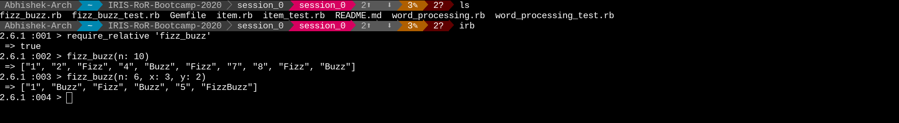

# Session 0 - Learning Ruby

As most of our participants are not familiar with Ruby, we have created
some exercises to learn and practice Ruby syntax - covering conditional
statements (`if`, `else`, `elsif`), different ways of iteration (`each`,
`select`, `map`) and basic object oriented code (defining and using
class, instance functions).

If you have studied any other programming language - the exercises are
about translating known concepts to Ruby and should be easy.

If concepts like `variable`, `function` and `class` are new to you, you
might require a gentler introduction to programming before learning
Rails. You can refer to books on programming or websites like 
[TryRuby](https://try.ruby-lang.org/) and
[Learn Ruby the Hard Way](https://learnrubythehardway.org/book/).

> Read the [installation guide](/installation.md) and [setting up local
> workspace](/essential_git.md) to get started.
>
> You can also read the [solution](https://github.com/IRIS-NITK/IRIS-RoR-Bootcamp-2020/pull/62) here.

## Fizz Buzz

Fizz Buzz is a word game for children to teach them about division.

We will use it to learn about transforming traditional C-like for loops
into ruby code and a bit of error handling.

The rules of the game are as follows:
- The first player says the number "1".
- Each subsequent player counts upwards in turn.
- Numbers divisible by 3 are replaced by the word "Fizz"
- Numbers divisible by 5 are replaced by the word "Buzz"
- Numbers divisible by both 3 and 5 are replaced by the word "FizzBuzz"

For example, a round of Fizz Buzz would go as follows:

```
1, 2, Fizz, 4, Buzz, Fizz, 7, 8, Fizz, Buzz, 11, Fizz, 13, 14, FizzBuzz,
16, 17, Fizz, 19, Buzz, Fizz, 22, 23, Fizz, Buzz, 26, Fizz, 28, 29,
FizzBuzz, 31, 32, Fizz, 34, Buzz, Fizz, ...
```

We will take a look at generalization of Fizz Buzz - instead of numbers
divisible by 3 or 5, we will let the user decide. They are denoted by
[keyword arguments](https://en.wikipedia.org/wiki/Named_parameter) `x`
and `y`.

The first keyword argument `n` represents the number of turns.

We will be returning an array of strings, containing what each player
says on their turn.

For example, `fizz_buzz(n: 6, x: 2, y: 3)` should return the following:
`["1", "Fizz", "Buzz", "Fizz", "5", "FizzBuzz"]`

What happens if the function is called by x (or y) = 0 or negative?

The divisiblity by zero is not defined and neither do the little
children know how to divide by negtive numbers.

We will raise an `ArgumentError` exception to let the caller know that
their arguments were incorrect.

> Implement the function `fizz_buzz` in the file `fizz_buzz.rb` and test
> your code with `ruby fizz_buzz_test.rb`.

- [Fizz Buzz - Wikipedia](https://en.wikipedia.org/wiki/Fizz_buzz)
- [Ruby - if...else, case, unless - TutorialPoint](https://www.tutorialspoint.com/ruby/ruby_if_else.htm)
- [Ruby Keyword Arguments](https://thoughtbot.com/upcase/videos/ruby-keyword-arguments)
- [How to Use Ruby Conversion Methods](https://www.rubyguides.com/2018/09/ruby-conversion-methods/)
- [A Beginner's Guide to Exceptions in Ruby](https://www.honeybadger.io/blog/a-beginner-s-guide-to-exceptions-in-ruby/)

## Word Processing

You are writing for a group that uses Machine Learning techniques to
read and summarize books and articles into smaller texts while retaining
the meaning.

Since the technique works only on lower case words, you want to write
two functions `lower_case(words)` and `lower_case!(words)` which
transform an array of words (representing contents of an article) into
all lower case characters. The function `lower_case` returns an copy of
the original array, transforming upper case to lower case characters
whereas the function `lower_case!` modifies the array in-place.

```ruby
words = ['', 'HELLO', 'WoRlD', 'nice']

lower_case(words) # returns ['', 'hello', 'world', 'nice']
puts words # ['', 'HELLO', 'WoRlD', 'nice']

lower_case!(words) # returns nil
puts words # ['', 'hello', 'world', nice']
```

The technique relies on prefix of words, you want to implement
`words_with_prefix(prefix, words)` which returns an array containing
only words that have the same prefix.

```ruby
words_with_prefix('apple', ['apple', 'ball', 'applesauce']) # returns ['apple', 'applesauce']
```

To eliminate redundant words (and thus compressing the text), you define
similarity score between two words as the length of the largest common
prefix between the words. The function `similarity_score` takes two
words and returns the similarity score.

```ruby
similarity_score('bike', 'bite') # 2, as 'bi' is the largest common prefix.
similarity_score('apple', 'bite') # 0, as there are no common letters in the prefixes.
```

To find the best possible match for a word from a given list of words
(and retaining the meaning as far as possible), you choose the word with
the maximum similarity score. The function
`most_similar_words(chosen_word, words)` find the best possible match(s)
for the chosen word.

```ruby
most_similar_words('apple', ['ball', 'applesauce', 'bike']) # returns ['applesauce']
most_similar_words('apple', ['ball', 'applesauce', 'bike', 'apple']) # returns ['applesauce', 'apple]
```

> Implement the functions described above in the file `word_processing.rb` and test
> your code with `ruby word_processing_test.rb`.

- [Substring - Wikipedia](https://en.wikipedia.org/wiki/Substring#Prefix)
- [downcase (String) - APIdock](https://apidock.com/ruby/v2_5_5/String/downcase)
- [start_with? (String)](https://apidock.com/ruby/String/start_with%3F)
- [Ruby Arrays and Common Array Methods](https://launchschool.com/books/ruby/read/arrays)

## BuySell

You are working for an e-commerce company _Buy-n-Sell_ and working on their
inventory functionality. 

The items sold by the company are represented by the class `Item`. An
`Item` stores the following information: 
- Name of the item.
- Price of the item.
- The category item belongs to.
- The discount rate if the item is on sale.
- The time when the sale ends.

You want to store `quantity` of the item too, so the company can keep
track of items which need to be re-stocked.

To help the company in analyzing their inventory, you come up with the
following metric:
- An item is _discounted_ if the discount deadline has not been yet
  crossed.
- The _current price_ of a discounted item is `price * (100 - discount
  rate ) /100`.
- The _current price_ of an regular item is same as `price`.
- The _stock price_ of item is defined as the product of _current price_ and
  _quantity_.
- The _stock price_ of a category is sum of individual stock prices of
  item belonging to the category.

The function `stock_price_by_category(items)` takes an array of items
and calculates the stock price of all categories.

> Implement the class `Item` above in the file `item.rb` and test
> your code with `ruby item_test.rb`.

- [How to use attr_accessor, attr_writer and attr_reader](https://www.rubyguides.com/2018/11/attr_accessor/)
- [Ruby - Classes and Objects](https://www.tutorialspoint.com/ruby/ruby_classes.htm)
- [Class: Time](https://ruby-doc.org/core-2.6.3/Time.html#method-c-now)
- [Class and Instance Methods in Ruby](http://www.railstips.org/blog/archives/2009/05/11/class-and-instance-methods-in-ruby/)
- [group_by (Enumerable)](https://apidock.com/ruby/Enumerable/group_by)
- [reduce (Enumerable)](https://apidock.com/ruby/Enumerable/reduce)

## Interactive Console

You can use the interactive ruby (`irb`) to help understand and debug
your code. `irb` is similar to python's interactive console and lets you
run any ruby code.

For example, to debug `fizz_buzz.rb` do the following:
- Open a ruby console using `irb`.
- Include the ruby program using `require_relative 'fizz_buzz'`.
- Execute the function (or any valid ruby statement using the
  interpreter).



- [How to use IRB to Explore Ruby](https://www.digitalocean.com/community/tutorials/how-to-use-irb-to-explore-ruby)
