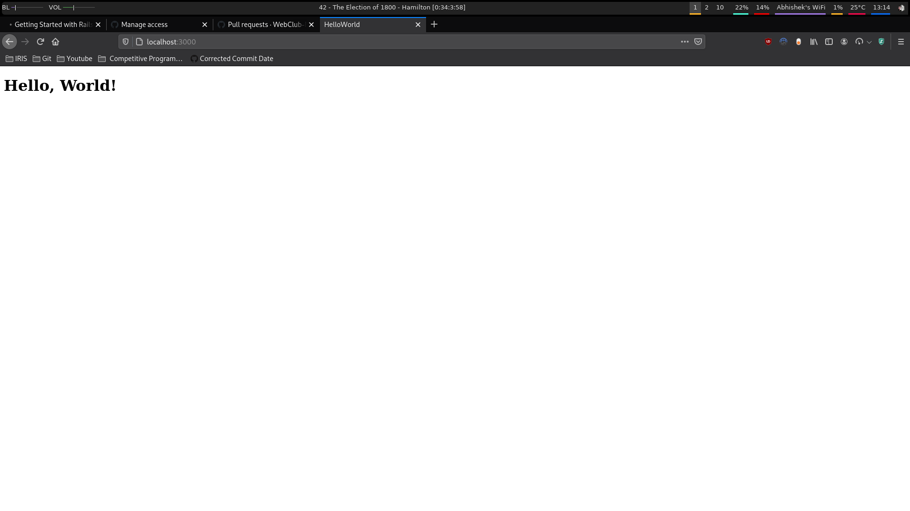
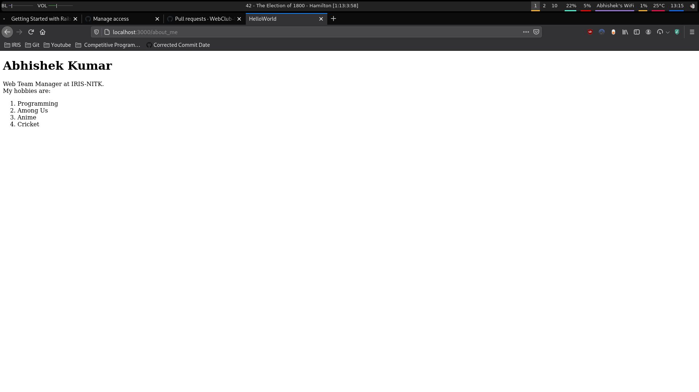
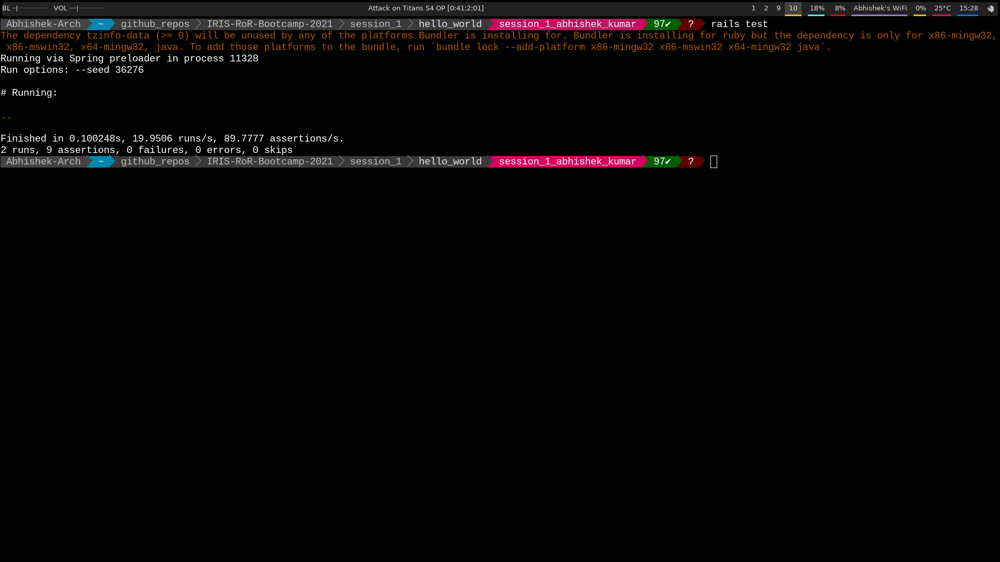

# Session 1 - Getting Started with Rails

The first sesssion is all about getting started with Rails.

[Session 1 - Getting Started with Rails (Slides)](slides.pdf)

We will create a website with two pages - a Home Page and an About Me
page.

The home page just contains a heading with text "Hello, World!" whereas
About Me page is more detailed, with the following elements:
- An heading with your name.
- An paragraph with your bio.
- An ordered list with four of your favorite hobbies.

For example, `@abhishekkumar2718`'s website looks like the following:





> The aim of session 1 is to become familiar with Rails and
> collaborating with others through Git. We will be building more
> impressive websites by the end of Bootcamp.

## Steps

- [Install Ruby and Rails](/installation.md)

- [Set Up Local Workplace](/essential_git.md)

### Create a Rails Project

- Create a new Rails project `hello_world` in the directory `session_1`:

```bash
cd session_1
rails new hello_world --skip-git
cd hello_world
```

> The command `rails new` initialises a Rails project. We have passed
> the flag `--skip-git` to avoid initializing Git again as we are
> already within a Git repository.

- Create a database and run the migrations using:

```bash
rails db:create
rails db:migrate
```

> A _database_ is a software to store and organize data. With databases,
> you don't have to worry *how* data is stored and can focus on the 
> rails application instead. A _database migration_ modifies the
> database schema i.e. tables, columns and entries in the database.

- Run the rails server using below command and go to http://localhost:3000/. 

```bash
rails server
```

You should see **Yay! You're on Rails!**:


### Customize Your Website

- Generate a new controller `PageController` with actions `root` and
  `about_me`:

```bash
rails generate controller Page root about_me
```

> A _controller_ is responsible for making sense of request and producing
> the appropriate output. It acts as a middleman between the Data
> (Model) and Presentation (View). Controllers are stored in
> `app/controllers` directory.

> A _generator_ creates and fills out files with default code, making
> your job easier. For example, the above command creates a controller
> `PagesController`, creates view files `root.html.erb` and
> `about_me.html.erb` and modifies the routes file - with a single
> simple instruction.

- Edit the routes file (`config/routes.rb`) as follow:

```ruby
Rails.application.routes.draw do
  get '/', to: 'page#root'
  get 'about_me', to: 'page#about_me'
end
```

> The routes file specifies the URLs that are recognized by the
> application. In the above example, we can visit
> https://localhost:3000/about_me but not https://localhost:3000/contact
> as it is not specified in the routes file.

- Edit the view files (`app/views/page/root.html.erb`,
  `app/views/page/about_me.html.erb`).

> A _View_ displays data in a desired format. As we are building
> web pages, the desired format is _HTML_. The view files are stored in
> `app/views` directory.

- Reload the pages `http://localhost:3000` and
  `http://localhost:3000/about_me` (on your web browser) to inspect
  your changes.

- Copy the test file from `session_1` directory to
  `hello_world/test/controllers`:

```bash
cp page_controller_test.rb hello_world/test/controllers
```

> Since we are creating a new application, the test file cannot exist
> yet and must be copied into the application. In the later exercises,
> we will no longer need to copy tests.

- Execute the test suite to ensure the page works as expected.

```bash
rails test
```



- If the test fails, check the view files and debug the application.

- Once the test works locally, [submit your changes](/essential_git.md).
