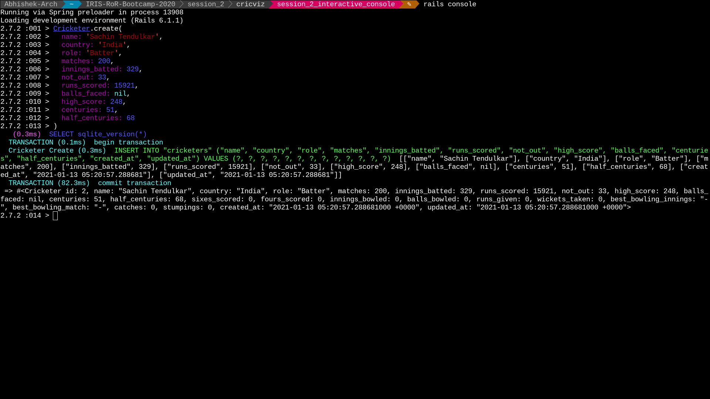

# Session 2 - Models

We take a closer look at _Model_ of the MVC architecture and talk about
databases, migrations and working with records.

The _model_ layer is responsible for storing and processing data.

We store data in a _relational database_ and process it in the
`app/models` of the Rails application.

A _relational database_ stores information as a set of tables with columns
and rows (_records_).  The tables and their columns are together called
a _schema_. You can think of relational database  as a spreadsheet with
each table on a different sheet.

> There are other non-tabular databases as well, which are better suited
> to specific problems: [What is a Database | Oracle](https://www.oracle.com/in/database/what-is-database/)

_Structured Query Language_ (SQL) is used to access and manipulate
databases. SQL can retrieve, create, read, update and destroy records,
modify schema and more. Working with SQL directly is difficult, so we
usually have a Rails equivalent.

The assignment is split into different sub-tasks, each testing a
different aspect of Model layer.

> We will be using SQLite as our database program, as it requires no
> setup and is Rails's default.

## Pre-requistes

- [Install Ruby and Rails](/installation.md)

- [Set Up Local Workplace](/essential_git.md)

## Prepare Local Database

- Change directory to rails project.

- Create the database

```bash
rails db:create
```

You should see two new files are created if not present already -
`development.sqlite3` and `test.sqlite3`.

- Run the migrations

```bash
rails db:migrate
```

Migrations are a convienient way to alter database schema (that is, modify
the tables and the columns) using a ruby-like language.

## Creating Tables

Relational databases stores information using tables. You can think of
tables and their columns as the format in which data is stored.

In this sub-task, we will build a website to keep track of enrolled
students. Head over to [Student Registry](student_registry/README.md) directory to learn
more.

## Working with Records

Once a table is created, we have to fill it with actual data. In
particular, we can create, read, update and destroy records in a table.
Each operation maps to a different SQL command and a different Rails
equivalent.

In this sub-task, we will work on statistics from Cricket and hope to
crack the problem of winning the fourth test match in Border-Gavaskar
series! Head over to [Cricviz](cricviz/README.md) directory to learn
more.


## Interactive Console

The Rails console is useful for testing out quick ideas with code and
debugging applications.

```bash
rails console
```

This should open a console, similar to IRB in the first session. We can
access your model functions and execute any valid ruby code.



- [The Rails Command Line](https://guides.rubyonrails.org/command_line.html#bin-rails-console)
