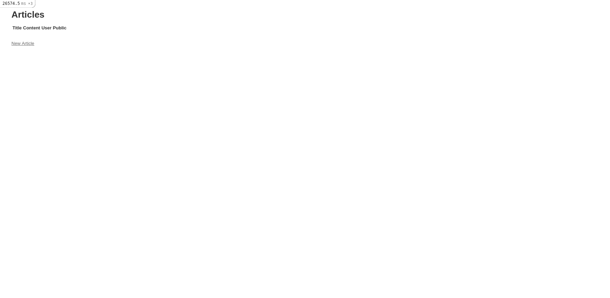
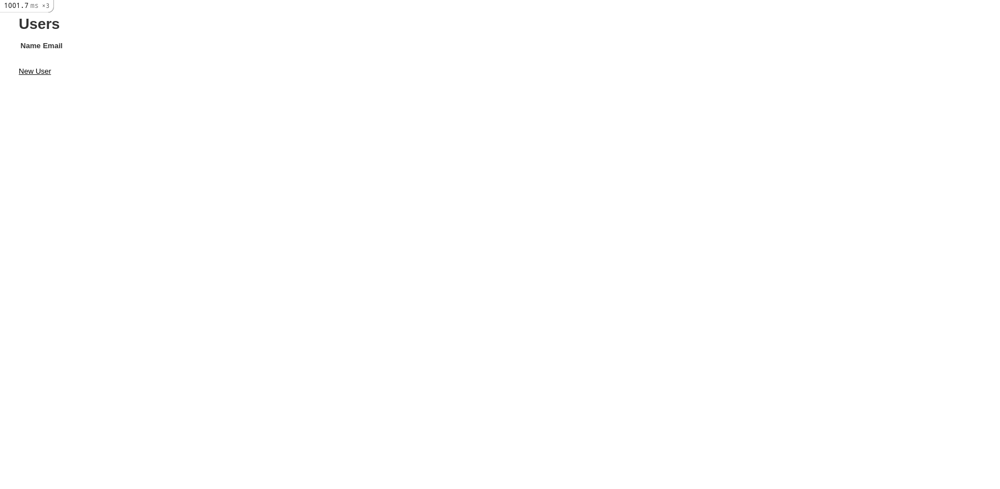
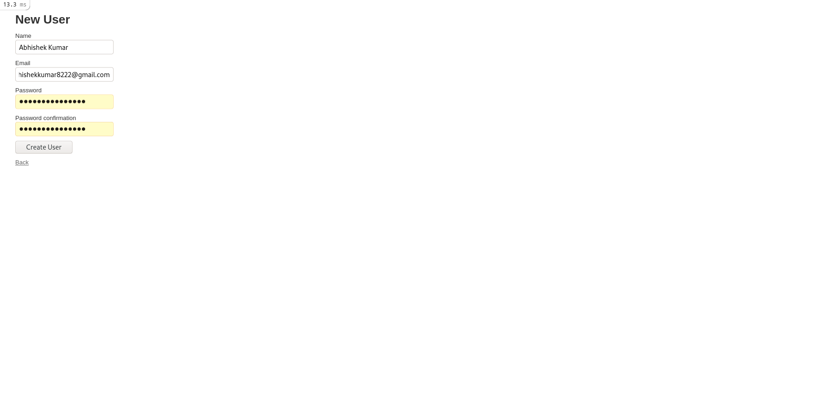
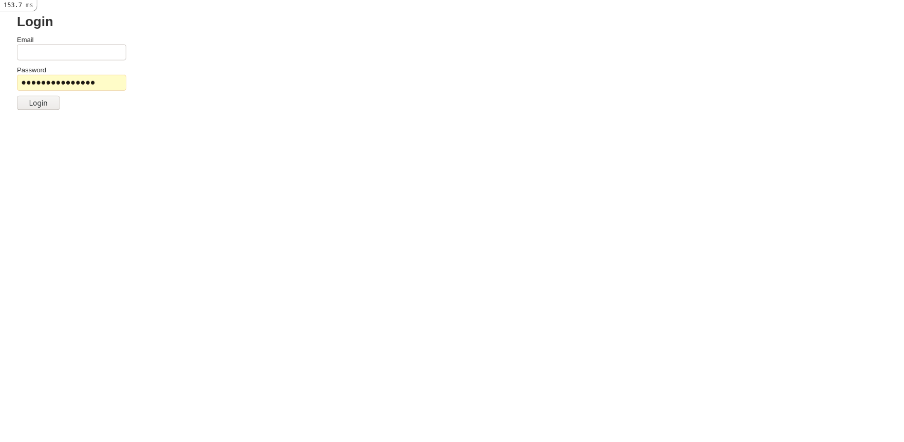
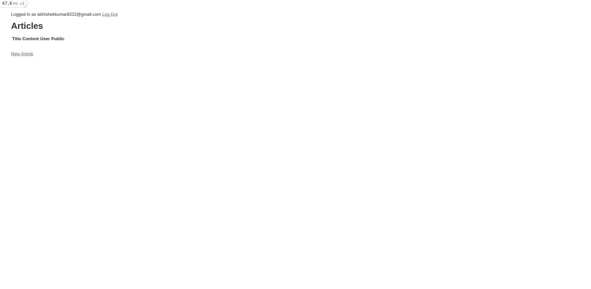

# Session 3 - Controllers and Routing

We now take a closer look at _Controller_ of the MVC architecture and
talk about controllers, routing, authentication and authorization.

The _controller_ layer is responsible for interacting with the Model
layer and deciding the appropriate presentation. The controllers are
in `app/controllers` directory of Rails application.

We will build a simple blogging website, _Blogspot_ (similar to [Medium](https://medium.com/)).

The exercise is _difficult and long_. Walk through the steps one at a
time, understand what each step tries to do and implement it.

## Pre-requistes

- [Install Ruby and Rails](/installation.md)

- [Set Up Local Workplace](/essential_git.md)

- [Prepare Local Database](/session_2/README.md)

## Routing

The Rails router `config/routes.rb` recognizes URLs and redirects them
to appropriate controller and action. In the first session, we
redirected `https://localhost:3000` to `PagesController` and `root`
action.

```ruby
Rails.application.routes.draw do
  get '/', to: 'page#root'
  get 'about_me', to: 'page#about_me'
```

We can add routes related to our models (called _resources_ in routing
terminology) using the keyword `resources`. This defines five essential
actions:
- Create one record with `new` and `create`
- Read one record with `show`
- Update one record with `edit` and `update`
- Delete one record with `destroy`
- Read all records with `index`

For example:

```ruby
Rails.application.routes.draw do
  resources :articles
end
```

We can now:
- See all articles at `localhost:3000/articles`.
- Read an article at `localhost:3000/articles/1`
- Create an article at `localhost:3000/articles/new`.
- Update an article at `localhost:3000/articles/1/edit`.
- Delete an article at `localhost:3000/articles/1`.

> HTTP Verbs are a part of routing magic. Read
> [What is REST? | Codeacademy](https://www.codecademy.com/articles/what-is-rest)
> and [Resource Routing: the Rails Default](https://guides.rubyonrails.org/routing.html#resource-routing-the-rails-default)
> to learn more.

While the default actions are usually enough, we can add custom actions
as well:

```ruby
Rails.application.routes.draw do
  resources :articles do
    member do
      put 'publish'
    end
  end
end
```

Here, we have defined a publish action as a special case for update.

- [The Rails Router](http://tutorials.jumpstartlab.com/topics/routes/router.html)
- [Rails Routing from the Outside In](https://guides.rubyonrails.org/routing.html#crud-verbs-and-actions)

## Controllers

The controller's jobs include:
- Work with request parameters (for example: form inputs).
- Determine how to use models and existing data.
- Respond to requests.

The functions inside of a controller file are called _actions_.

A controller typically has the following actions:
- create
- new
- show
- index
- edit
- update
- destroy

Often, we want to load some variables or run some checks before an
action is executed. For example, we might want to check if the user is
logged in or has appropriate permissions before responding with a page.

In such cases, we can use a `before_action` as follows:

```ruby
class ArticlesController < ApplicationController::Base
  # Check if the user is logged in before every request.
  before_action :require_login

  ...

  def require_login
    # Send to login page if not logged in
  end
end
```

We can additionally run the `before_action` on specific actions using
`only` and `except` keywords.

## Authentication

Authentication is the process by which users can log in and out of their
accounts. For example, we might want to restrict access to certain
articles only to registered users.


We will be implementing Authentication from scratch, although we
recommend using the gem [devise](https://github.com/heartcombo/devise)
once you are familiar with Rails and authentication mechanisms.

## Authorization

Authorization restricts what resources a given user is allowed to
access. For example: we might allow users to delete their own articles
as well as adminstrators to delete any article. 

We will be using [CanCanCan](https://github.com/CanCanCommunity/cancancan),
an authorization gem to keep the process simple.

## Blogspot

Blogspot is a blogging website with the following features:
- Users can register and log into their accounts.
- Users can create, read, update and delete _their own_ articles.
- Unregistered users can read only _public_ articles but registered
  users can read both _public_ and _private_ articles.
- Adminstrators can delete _any_ article.

### Steps

#### [Install Ruby and Rails](/installation_guide.md)

#### [Create a New Rails Project](/session_1/README.md)

#### [Prepare Local Database](/session_2/README.md)

#### Create Scaffolding for Articles

The Article table has:
- A string column for the title of the article.
- A string column for the topic of the article.
- A string column for the tags of the article.
- A text column for the content of the article.

Since we want model, controllers and views for the Article class, we
will use `rails scaffold` to get started.

```
rails generate scaffold Article name:string content:text user_id:integer public:true
```

The above command generates the following important files:
- `db/migrate/<YYYYMMDDHHMMSS>_create_articles.rb`,
  `app/models/articles.rb` are the migration and model file
  respectively and have been covered in
  [Session 2 - Model](/session_2/README.md).
- `app/controllers/articles_controller`: The controller for Articles -
  defines how to present views.
- `app/views/articles/*`: The view files for Articles.
- `config/routes.rb`: Describes the URLs that can be accessed on the
  application.

After running the migration and opening
`http://localhost:3000/articles`, you should see something like:



- Let's redirect root url (`localhost:3000`) to the articles index page
  as well instead of Welcome page by editing `config/routes.rb`.

```ruby
Rails.application.routes.draw do
  root to: 'articles#index'

  resources :articles
end
```

At this point, we are allowing unregistered users to create and read
private articles. Let's fix that by adding authentication.

#### Add Authentication

The steps here follow from the excellent tutorial, [Authentication from
Scratch with Rails 5.2](https://medium.com/@wintermeyer/authentication-from-scratch-with-rails-5-2-92d8676f6836)
but modified for our project.

- Install [bcrypt](https://github.com/codahale/bcrypt-ruby) to encrypt
  and keep passwords secure by adding the following line to `Gemfile`
  and running `bundle install`

```ruby
gem 'bcrypt'
```

- Create a `User` scaffold (as we need models, controller and views). We
  are adding a user table with a string column for name and e-mail, and
  storing passwords in encrypted form. The e-mails must be unique as
  well.

```
rails generate User name:string email:uniq password:digest
```

After running the migration and opening `http://localhost:3000/users`,
you should see something like:



You can create a new user by clicking on `New User` and filling out
details:



With this, User registration and resetting password are set up. But we
still need pages from which User can log into their account.

- Create a sessions controller with three actions - new, create and
  destroy.

```
rails generate controller sessions new create destroy
```

- We put the following code into `app/controllers/sessions_controller.rb`:

```ruby
class SessionsController < ApplicationController
  def new
  end

  def create
    user = User.find_by_email(params[:email)
    if user && user.authenticate(params[:password])
      session[:user_id] = user.id
      redirect_to root_url, notce: 'Logged in!'
    else
      flash[:alert] = 'Email or password is invalid'
      render 'new'
    end
  end

  def destroy
    session[:user_id] = nil
    redirect_to root_url, notice: 'Logged out!'
  end
end
```

As you can see we are using `session[:user_id]` to store the logged in
user id.

- We modify the routes files to allow requests for the
  SessionsController:

```ruby
Rails.application.routes.draw do
  root to: 'articles#index'

  resources :articles
  resources :users

  resources :sessions, only: [:new, :create, :destroy]
end
```

> Note: Despite not having a `sessions` table or model, we are
> effectively treating it as resource with create and destroy
> operations.

- We create the login page at `app/views/sessions/new.html.erb`:

```erb
<p id="alert"><%= alert %></p>

<h1>Login</h1>

<%= form_with sessions_path, remote: false do |f| %>
  <div class="field">
    <%= f.label :email %>
    <%= f.email_field :email %>
  </div>

  <div class="field">
    <%= f.label :password %>
    <%= f.password_field :password %>
  </div>

  <div class="actions">
     <%= f.submit 'Login' %>
  </div>
<% end %>
```



- While everything works, remembering `localhost:3000/sessions/new` is
  hard to do. Let's add easy to remember routes:

```ruby
Rails.application.routes.draw do
  root to: 'articles#index'

  resources :articles
  resources :users

  resources :sessions, only: [:new, :create, :destroy]

  get 'signup', to: 'users#new', as: 'signup'
  get 'login', to: 'sessions#new', as: 'login'
  delete 'logout', to: 'sessions#destroy', as: 'logout'
end
```

- Log in and log out process works as expected but it's not clear
  whether we are logged in by looking at the page. Let's add a
  navigation bar:

`app/controllers/application_controller.rb`:

```ruby
class ApplicationController < ActionController::Base
  helper_method :current_user

  def current_user
    if session[:user_id]
      @current_user ||= User.find(session[:user_id])
    else
      @current_user = nil
    end
  end
end
```

`app/views/layout/application.html.erb`:
```erb
<!DOCTYPE html>
<html>
  ...
  <body>
    <% if current_user %>
      Logged in as <%= current_user.email %>
      <%= link_to 'Log Out', logout_path %>
    <% else %>
      <%= link_to 'Sign Up', signup_path %>
      <%= link_to 'Log In', login_path %>
    <% end %>
  </body>

  <%= yield %>
</html>
```



Authentication is now completed!

#### Modifying Articles

We will add two new columns to the `articles`:
- An integer column `user_id` to store the user id of author of the
  article.
- An boolean column `public` to store whether the article can be read by
  unregistered users.

These two columns are important for us to identify whether a user can
read, update, destroy an article or not.

- Add a migration to add new columns and migrate.

```
rails generate migration add_authorization_columns_articles_table user_id:integer public:boolean
```

- Add a radio button in `app/views/articles/_form.html.erb` for `public`
  attribute.

```erb
<%= form_with(model: article) do |form| %>
  <% if article.errors.any? %>
    <div id="error_explanation">
      <h2><%= pluralize(article.errors.count, "error") %> prohibited this article from being saved:</h2>

      <ul>
        <% article.errors.each do |error| %>
          <li><%= error.full_message %></li>
        <% end %>
      </ul>
    </div>
  <% end %>

  <div class="field">
    <%= form.label :title %>
    <%= form.text_field :title %>
  </div>

  <div class="field">
    <%= form.label :topic %>
    <%= form.text_field :topic %>
  </div>

  <div class="field">
    <%= form.label :tags %>
    <%= form.text_field :tags %>
  </div>

  <div class="field">
    <%= form.label :content %>
    <%= form.text_area :content %>
  </div>

  <div class="field">
    <%= form.label :public %>
    <%= form.check_box :public %>
  </div>

  <div class="actions">
    <%= form.submit %>
  </div>
<% end %>
```

- Permit values assigned to `public` attribute to used for mass
  assignment by updating `article_params` function in
  `app/controllers/articles_controller.rb`.

```
def article_params
  params.require(:article).permit(:title, :topic, :tags, :content, :public)
end
```

- Assign user id to a new Article when it is being created by updating
  `create` function in `app/controllers/articles_controller.rb`

```ruby
def create
  @article = Article.new(article_params)
  @article.user_id = current_user.id

  if @article.save
    redirect_to @article, notice: 'Article was successfully created.'
  else
    render :new
  end
end
```

#### Adding Authorization

We will be using [CanCanCan](https://github.com/CanCanCommunity/cancancan),
an authorization library to simplify the adding authorization.

- Install CanCanCan by adding the following line to Gemfile and running
  `bundle install`.

```ruby
gem 'cancancan'
```

- Generate an `Ability` class - CanCanCan calls the actions a user can
  take _abilities_.

```
rails g cancan:ability
```

- Edit `app/models/ability.rb` as follows:

```ruby
class Ability
  include CanCan::Ability

  def initialize(user)
    # All users
    # Can read public articles
    can :show, Article, public: true

    # Additional permissions for logged in users
    if user.present?
      # Can read private articles
      can :show, Article, public: false

      # Can create articles
      can :new, Article
      can :create, Article

      # Can edit their own articles
      can :edit, Article, user_id: user.id
      can :update, Article, user_id: user.id

      # Can destroy their own articles
      can :destroy, Article, user_id: user.id
    end
  end
end
```

We have defined the different abilities different type of users have.

- Add `load_and_authorize_resource` to `ArticlesController` to check
  every request that user makes.

```ruby
class ArticlesController < ApplicationController
  load_and_authorize_resource

  ...
end
```

Authorization is complete!

However, at this point we still have useless links which the user can
still click and be redirected back to root url.

We can check the current user's permission using:

```erb
<% if can? :create, Article %>
  <%= link_to 'New Article', new_article_path %>
<% end %>
```

> Once done, you can submit your code changes and create a pull request.
> There are no automated tests for the session although you can add
> screenshots of the website in the pull request description.

#### Bonus Tasks

- Extend the authorization in a similar sense to `UsersController` to
  prevent users from changing each other's profile information and
  passwords.

- Certain users (called `admins`) can delete articles created by their
  users as well, update lost passwords and other administrative tasks.

  Try implementing that by:
  - Adding a boolean column to `users` table called `admin`.
  - Adding additional abilities if the user.admin is true.

- Some popular websites like to limit the number of "private" articles
  an authenticated user can read to 3 or 5. You can implement the same
  feature by:
  - Adding an attribute `private_articles_remaining` to the Users model.
  - Store the number of `private_articles_remaining` in `sessions`
    variable and decrement it on each private article read.
  - Pass down the number of remaining articles to the ability check.
