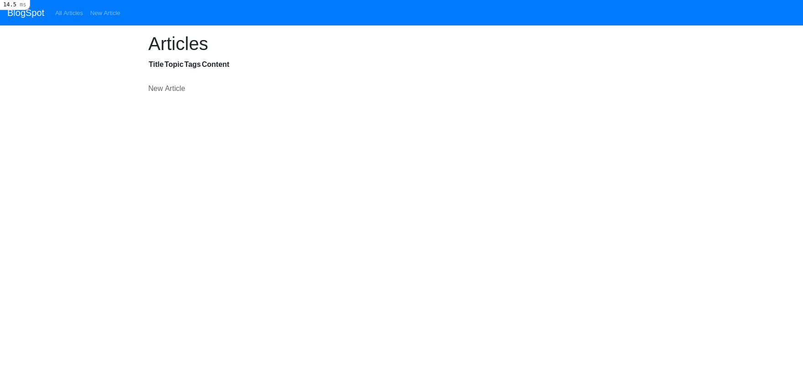
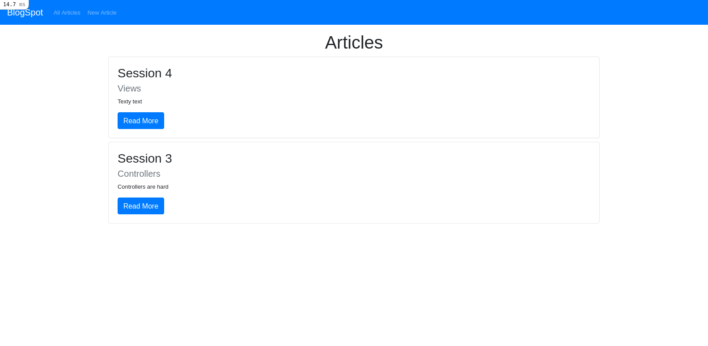
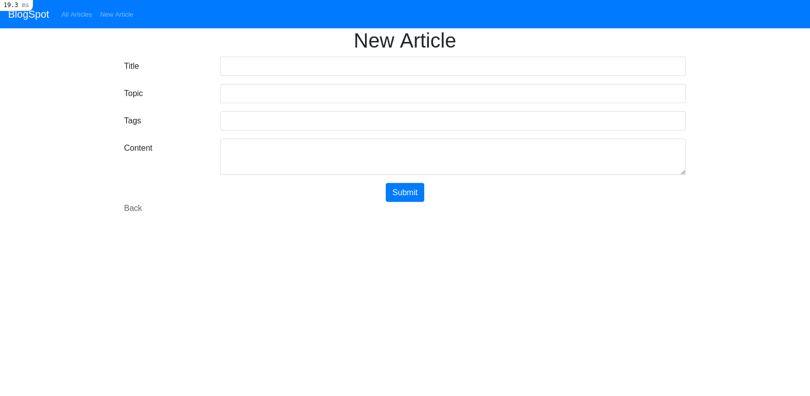
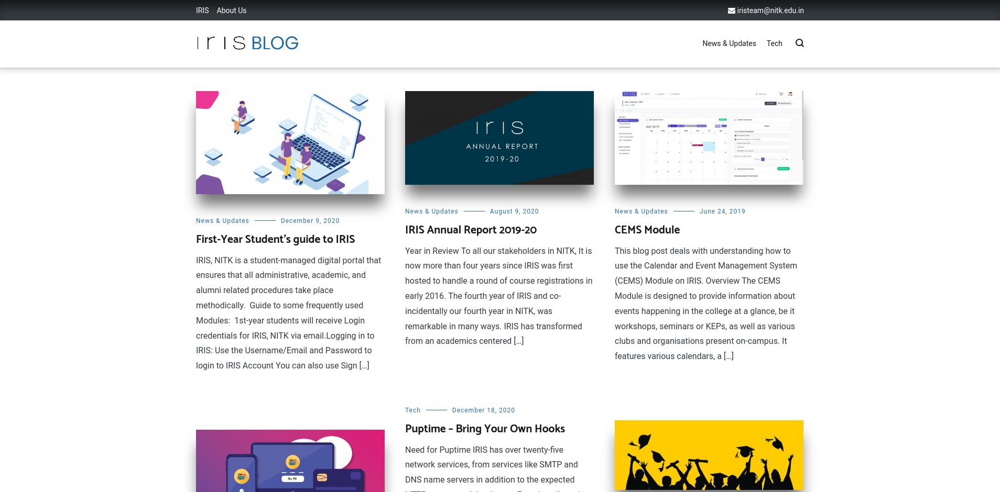
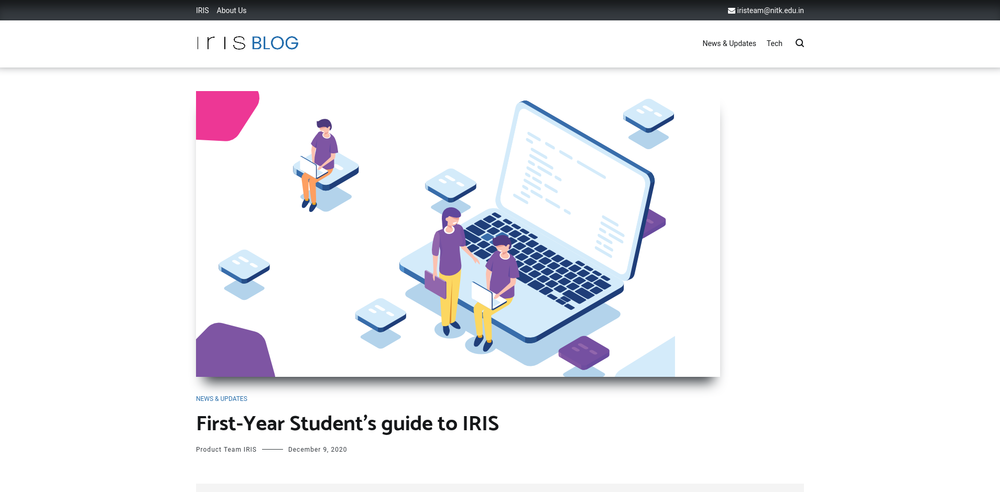

# Session 4 - Views

To wrap up the Award-Winning trilogy of abstraction layers, we take a
closer look at _View_ of the MVC architecture.

The _view_ layer is responsible for presenting data appropriately. In a
Rails application, the views are stored in `app/views` folder.

Each controller has their own views and the name of view file must match
the action name exactly. Depending on the action executed, the views are
used.

We will take up [BlogSpot](/session_3/README.md), our blogging website
where we left off in the third session and improve the design.

> Throughout the session, consider the views to be HTML-based unless
> specified otherwise.

- https://www.theodinproject.com/courses/ruby-on-rails/lessons/views

## Pre-requistes

- [Install Ruby and Rails](/installation.md)

- [Set Up Local Workplace](/essential_git.md)

- [Implement Blogspot](/session_3/README.md)

## Views as HTML Files

At a basic level, views are HTML files in which we insert information
from our controllers. As views are HTML files, anything that works in
HTML, CSS and Javascript works here.

- [HTML Tutorial](https://www.w3schools.com/html/default.asp)
- [Javascript Tutorial](https://www.w3schools.com/js/default.asp)

## Embedded Ruby

Embedded Ruby refers to pieces of code in between HTML code, to make the
views dynamic and extensible.

There are two ways of invoking ERB:
- `<%=` and `%>` wrap Ruby code whose return value will be output in
  place of marker.
- `<%` and `%>` wrap Ruby code whose return value will NOT be output.

```
# Displays current time
<p>Page generated at: <%= DateTime.now %></p>

# Does display not current time
<p>Page generated at: <% DateTime.now %></p>
```


The non-returning tag is used for iterating and preparing data:

```erb
<% @articles.each do |article| %>
  <tr>
    <td><%= article.title %></td>
    <td><%= article.content %></td>
    ...
  </tr>
<% end %>
```

The variables are shared between the controller and views using [instance
variables](https://www.rubyguides.com/2019/07/ruby-instance-variables/), that is variables prefixed by `@`:

```ruby
class ArticlesController < ApplicationController
  def index
    @articles = Article.all
  end
end
```

```erb
<% @articles.each do |article| %>
  <tr>
    <td><%= article.title %></td>
    <td><%= article.content %></td>
    ...
  </tr>
<% end %>
```

## Blogspot

We will take up [Blogspot](/session_3/README.md), our blogging website
where we left off in the third session and improve the design.

If you did not attempt it:

- Create a new Rails project.

- Generate scaffold for Article:

```bash
rails generate scaffold Article title:string topic:string tags:string content:text
```

> I initially wrote a lot more on what and how things work without an
> example to bind them together. If things are unclear, you can read up
> the extended description in [THEORY.md](THEORY.md)
>
> Hopefully, I struck the right combination between theory and practice.

### Integrate Bootstrap

[Bootstrap](https://getbootstrap.com/) is a popular frontend framework,
with many ready-made themes. 

While you can write your frontend code from scratch, we are going to use
Bootstrap (or any other frontend framework) because UX is _hard_.

- Check Yarn is installed

```bash
yarn --version
```

- Add Bootstrap and its dependencies using Yarn.

```bash
yarn add bootstrap jquery popper.js
```

- Add Bootstrap to `config/webpack/environment.js`:

```js
const { environment } = require('@rails/webpacker')

const webpack = require('webpack')
environment.plugins.append('Provide',
  new webpack.ProvidePlugin({
    $: 'jquery',
    jQuery: 'jquery',
    Popper: ['popper.js', 'default']
  })
)

module.exports = environment
```

- Modify `app/javascript/packs/application.js` as:

```js
import Rails from "@rails/ujs"
import Turbolinks from "turbolinks"
import * as ActiveStorage from "@rails/activestorage"
import "channels"
import 'bootstrap'

Rails.start()
Turbolinks.start()
ActiveStorage.start()
```

- Rename `app/assets/stylesheets/application.css` to
  `app/assets/stylesheets/application.scss` and add the following line:

```scss
@import "bootstrap/scss/bootstrap";
```

You should see that the article index page looks different:


- [How to install Bootstrap and jQuery on Rails 6](https://blog.makersacademy.com/how-to-install-bootstrap-and-jquery-on-rails-6-da6e810c1b87)

### Add Navigation Bar

A layout defines the surrounding of an HTML page. It's the place to
decide a common look and feel of the generated page.

If we take a look at HTML generated for `localhost:3000/`:

```html
<!DOCTYPE html>
<html>
  <head>
    <title>Blogspot</title>
    <meta name="viewport" content="width=device-width,initial-scale=1">
    <meta name="csrf-param" content="authenticity_token" />
<meta name="csrf-token" content="anEwoWcaAtjekyFp9eV5Q29Onizd1yJODdBm1yGzFFcuUEIcteEptvYtWyQ3dYWVsMdK2ZztSfhCqTPN4d2Vlg" />


    <link rel="stylesheet" media="all" href="/assets/application.debug-b7103d3ca3f4a5f05a52352703e8affbf6b6b70a77f281c7d1c279d0aaeaf43c.css" data-turbolinks-track="reload" />
    <script src="/packs/js/application-7728324484fe08e5bd23.js" data-turbolinks-track="reload"></script>
  </head>

  <body>
    <p id="notice"></p>

    <h1>Articles</h1>

    <table>
      <thead>
        <tr>
          <th>Title</th>
          <th>Topic</th>
          <th>Tags</th>
          <th>Content</th>
          <th colspan="3"></th>
        </tr>
      </thead>

      <tbody>
      </tbody>
    </table>

    <br>

    <a href="/articles/new">New Article</a>

    <script async type="text/javascript" id="mini-profiler" src="/mini-profiler-resources/includes.js?v=10da952c710f6abd9f1bd50fe50ed714" data-css-url="/mini-profiler-resources/includes.css?v=10da952c710f6abd9f1bd50fe50ed714" data-version="10da952c710f6abd9f1bd50fe50ed714" data-path="/mini-profiler-resources/" data-current-id="o0l62a7blto5f9yu1gj7" data-ids="o0l62a7blto5f9yu1gj7" data-horizontal-position="left" data-vertical-position="top" data-trivial="false" data-children="false" data-max-traces="20" data-controls="false" data-total-sql-count="false" data-authorized="true" data-toggle-shortcut="alt+p" data-start-hidden="false" data-collapse-results="true" data-html-container="body" data-hidden-custom-fields=""></script>
  </body>
</html>
```

But the view file `app/views/articles/index.html.erb` contains only:

```erb
<p id="notice"><%= notice %></p>

<h1>Articles</h1>

<table>
  <thead>
    <tr>
      <th>Title</th>
      <th>Topic</th>
      <th>Tags</th>
      <th>Content</th>
      <th colspan="3"></th>
    </tr>
  </thead>

  <tbody>
    <% @articles.each do |article| %>
      <tr>
        <td><%= article.title %></td>
        <td><%= article.topic %></td>
        <td><%= article.tags %></td>
        <td><%= article.content %></td>
        <td><%= link_to 'Show', article %></td>
        <td><%= link_to 'Edit', edit_article_path(article) %></td>
        <td><%= link_to 'Destroy', article, method: :delete, data: { confirm: 'Are you sure?' } %></td>
      </tr>
    <% end %>
  </tbody>
</table>

<br>

<%= link_to 'New Article', new_article_path %>
```

The remaining HTML is generated by `app/views/layouts/application.html.erb`:

```erb
<!DOCTYPE html>
<html>
  <head>
    <title>Blogspot</title>
    <meta name="viewport" content="width=device-width,initial-scale=1">
    <%= csrf_meta_tags %>
    <%= csp_meta_tag %>

    <%= stylesheet_link_tag 'application', media: 'all', 'data-turbolinks-track': 'reload' %>
    <%= javascript_pack_tag 'application', 'data-turbolinks-track': 'reload' %>
  </head>

  <body>
    <%= yield %>
  </body>
</html>
```

The application layout is shared by all pages, making it ideal for
features shared across all pages. The navigation bar is one such
example. We will be using the [Bootstrap Navbar component](https://getbootstrap.com/docs/4.5/components/navbar/).

- Insert the following into the application layout:

```erb
<!DOCTYPE html>
<html>
  <head>
    <title>Blogspot</title>
    <meta name="viewport" content="width=device-width,initial-scale=1">
    <%= csrf_meta_tags %>
    <%= csp_meta_tag %>

    <%= stylesheet_link_tag 'application', media: 'all', 'data-turbolinks-track': 'reload' %>
    <%= javascript_pack_tag 'application', 'data-turbolinks-track': 'reload' %>
  </head>

  <body>
    <nav class="navbar navbar-expand-lg navbar-dark bg-primary">
      <%= link_to 'BlogSpot', root_path, class: 'navbar-brand' %>

      <button class="navbar-toggler" type="button" data-toggle="collapse" data-target="#navbarSupportedContent" aria-controls="navbarSupportedContent" aria-expanded="false" aria-label="Toggle navigation">
        <span class="navbar-toggler-icon"></span>
      </button>

      <div class="collapse navbar-collapse" id="navbarSupportedContent">
        <ul class="navbar-nav mr-auto">
          <li class="nav-item">
            <a class="nav-link" href="/articles">All Articles</a>
          </li>

          <li class="nav-item">
            <a class="nav-link" href="/articles/new">New Article</a>
          </li>
        </ul>
      </div>
    </nav>

    <%= yield %>
  </body>
</html>
```

To make the process of adding hyperlinks easier, Rails provides us with
a helper function to generate the markup - `link_to`.

We can replace the hyperlink in the code with:

```erb
<%= link_to 'BlogSpot', root_path, class: 'navbar-brand' %>
```

Likewise, we can link to resources as well. For example:

```erb
<%= link_to 'All Articles', articles_path, class: 'navbar-link' %>
```

Our content runs from edge to edge on the screen, which is often hard to
read. Most people are comfortable with close to 80 characters per line,
so we will wrap the content using a [Bootstrap Container](https://getbootstrap.com/docs/4.5/layout/overview/#containers).

- Enclose the `<%= yield %>` tag with:

```erb
<div class="container">
  <%= yield %>
</div>
```



- [Ruby on Rails - Layouts](https://www.tutorialspoint.com/ruby-on-rails/rails-layouts.htm)
- [How to Use link_to in Rails](https://mixandgo.com/learn/how-to-use-link_to-in-rails)

### Improve Index Page

We will improve the look of the articles index page using [Bootstrap
Card component](https://getbootstrap.com/docs/4.5/components/card/)
in a partial.

- Replace the contents of `app/views/articles/index.html.erb` with:

```erb
<p id="notice"><%= notice %></p>

<h1 class="text-center">Articles</h1>

<% @articles.each do |article| %>
  <div class="card mb-2">
    <div class="card-body">
      <h3 class="card-title">
        <%= article.title %>
      </h3>

      <h5 class="card-subtitle mb-2 text-muted">
        <%= article.topic %>
      </h5>

      <p class="card-text">
        <%= article.content[0, 80] %>
      </p>

      <%= link_to 'Read More', article, class: 'text-white btn btn-primary' %>
    </div>
  </div>
<% end %>
```

When writing Ruby, we break up complex methods into multiple, smaller
methods. Likewise, when writing views, we break up complex view files
into smaller partials.

- The partials are named with the leading underscore and are in the same
  directory as the original view.
- You can pass variables to partials using `locals` keyword.

As the markup for each article is getting complicated, we can move to a
new partial called `card`.

- Create a new file `app/views/articles/_card.html.erb` and place
  article-specific HTML in it.

- Replace the contents of `app/views/article/index.html.erb`:

```erb
<p id="notice"><%= notice %></p>

<h1 class="text-center">Articles</h1>

<% @articles.each do |article| %>
  <%= render partial: 'card', locals: {article: article} %>
<% end %>
```



- [Using Partials | Layouts and Rendering](https://guides.rubyonrails.org/layouts_and_rendering.html#using-partials)

### Improve Form

The HTML form when we are creating or editing an article is stored in
`app/views/articles/_form.html.erb`. Since the file name begins with an
underscore, it is a partial. Taking a closer look:

```erb
<%= form_with(model: article) do |form| %>
  <% if article.errors.any? %>
    <div id="error_explanation">
      <h2><%= pluralize(article.errors.count, "error") %> prohibited this article from being saved:</h2>

      <ul>
        <% article.errors.each do |error| %>
          <li><%= error.full_message %></li>
        <% end %>
      </ul>
    </div>
  <% end %>

  <div class="field">
    <%= form.label :title %>
    <%= form.text_field :title %>
  </div>

  <div class="field">
    <%= form.label :topic %>
    <%= form.text_field :topic %>
  </div>

  <div class="field">
    <%= form.label :tags %>
    <%= form.text_field :tags %>
  </div>

  <div class="field">
    <%= form.label :content %>
    <%= form.text_area :content %>
  </div>

  <div class="actions">
    <%= form.submit %>
  </div>
<% end %>
```

The `form_with` tag takes a model (or a url), fields and generates a
HTML form. For example, by passing the variable `article` as an local
variable to the partial, Rails figures out whether to create a new
article or to update an existing article and pre-fill the forms.

The `article.errors` variable stores any errors that occur during 
saving the record. For example, we cannot store an article with empty
title.

As writing forms can be cumbersome, we will be using the gem
`bootstrap_form` to simplify the process:

- Add `bootstrap_form` to your Gemfile:

```ruby
gem 'bootstrap_form', '~> 4.0'
```

- Run `bundle install`

- Add the following line to your `app/assets/stylesheets/application.scss` file:

```scss
@import "rails_bootstrap_forms";
```

- Replace the contents of `app/views/articles/_form.html.erb` with:

```erb
<%= bootstrap_form_with(model: article, layout: :horizontal) do |form| %>
  <% if article.errors.any? %>
    <div id="error_explanation">
      <h2><%= pluralize(article.errors.count, "error") %> prohibited this article from being saved:</h2>

      <ul>
        <% article.errors.each do |error| %>
          <li><%= error.full_message %></li>
        <% end %>
      </ul>
    </div>
  <% end %>

  <%= form.text_field :title %>
  <%= form.text_field :topic %>
  <%= form.text_field :tags %>
  <%= form.text_area :content %>

  <div class="text-center">
    <%= form.submit "Submit", class: 'btn btn-primary' %>
  </div>
<% end %>
```

Now the form looks better and is fewer lines of code!



- [HTML Forms](https://www.w3schools.com/html/html_forms.asp)
- [Action View Form Helpers](https://guides.rubyonrails.org/form_helpers.html)
- [Helpers for Generating Form Elements](https://guides.rubyonrails.org/form_helpers.html#helpers-for-generating-form-elements)

## Submission and Bonus Tasks

While the website looks half-decent now, there are many possible
improvements:

- Improve design of authentication-related views: Log In, Sign Up and
  Reset Password views.

- Improve the design of `article#show` view:
  - Use Bootstrap components where applicable.
  - Add cover pictures to article page as well as the index page:




- Download articles as PDFs for offline viewing. Refer to the section
  [Presenting Other Formats](/session_4/THEORY.md#presenting-other-formats)
  to learn how.

- Move `flash[:notice]` and `flash[:alert]` to application layout and
  either use [Bootstrap Alerts](https://getbootstrap.com/docs/4.5/components/alerts/)
  or [Bootstrap toasts](https://getbootstrap.com/docs/4.5/components/toasts/).

- Give the impression of faster page loads using Ajax for forms and
  displaying articles: https://www.rubyguides.com/2019/03/rails-ajax/

- Use a [Bootstrap Carousel](https://getbootstrap.com/docs/4.5/components/carousel/)
  on articles index page to display 3 "featured" or "popular" articles.

Once you are done with the design changes, create a pull request adding
screenshots of the website to the description to the pull request or the
project README.
