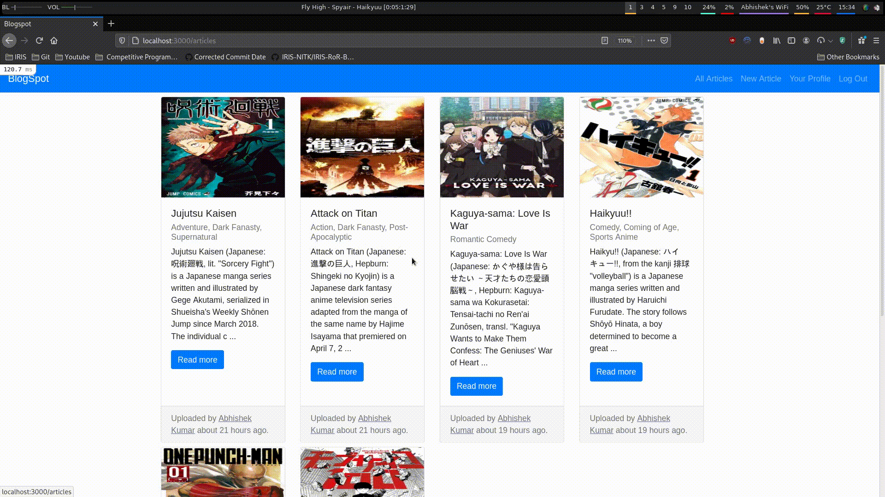
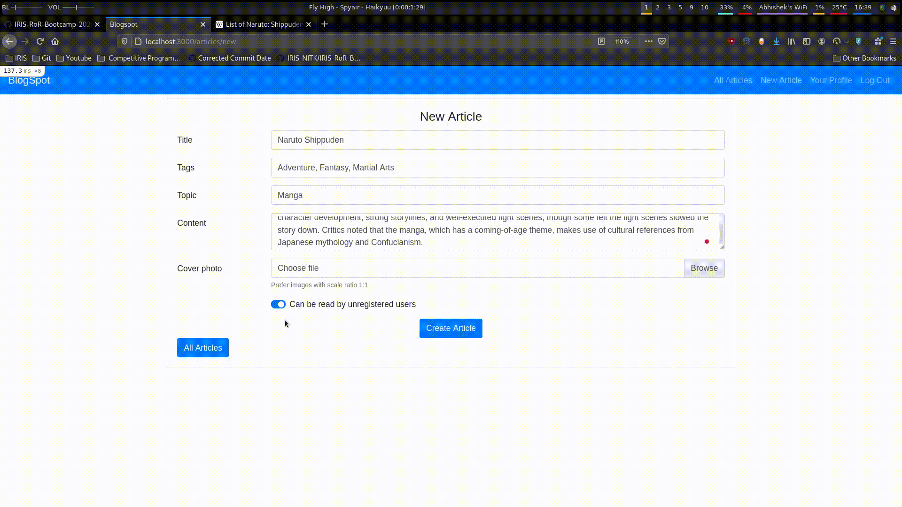
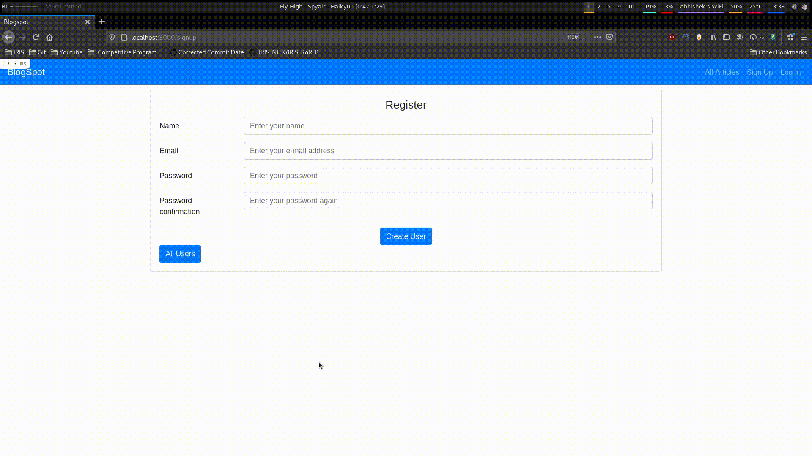
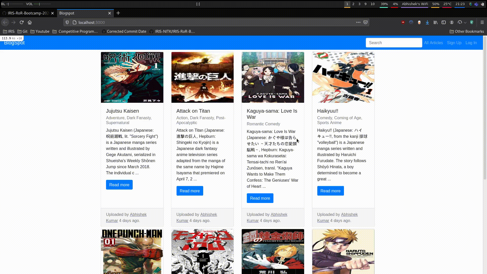

# Session 6 - JavaScript and AJAX

_Asynchronous JavaScript and XML_ is an approach to build web
applications that are able to make quick, incremental updates to the
user interface without reloading the entire browser page. This makes the
application faster and more responsive to user actions.

When you type `http://localhost:3000` into your browser's address bar
and hit 'Go', it makes a request to the server, parse the response and
fetches all associated assets like JavaScript files, stylesheets and
images. Then it assembles the page together. However, using _Ajax_ we
can update the parts of the page without needing to get the full page
data from the server and fetching all associated assets.

In particular, using JavaScript to make requests and incrementally
update the website improves the user experience and reduce friction
for certain actions.

We will be using JavaScript and AJAX to improve the user experience of
[BlogSpot](/session_4/README.md), our blogging website by implementing
features like autocomplete, form validation and more.

- [Getting Started with Ajax | MDN](https://developer.mozilla.org/en-US/docs/Web/Guide/AJAX/Getting_Started)

## Pre-requistes

- [Install Ruby and Rails](/installation.md)

- [Set Up Local Workplace](/essential_git.md)

- [Implement Blogspot](/session_4/README.md)

## Modern JavaScript

Throughout the session, I will assume _some_ familiarity with JavaScript
and jQuery. In case you would like to learn more about Javascript, you
can refer to [The Modern JavaScript Tutorial](https://javascript.info/).

## `app/javascript` vs Server-Side JavaScript

Since Rails 6, Rails uses [Webpacker](https://edgeguides.rubyonrails.org/webpacker.html)
as the default build system for JavaScript, CSS and other assets - which
can often be tricky and unintuitive.

As JavaScript can now be written in two places: `app/javascripts/packs`
and `js.erb` view files - it's important to understand the distinction
between two.

`app/javascripts/packs` should contain JavaScript that is same for all
users (say form-validation) whereas `js.erb` view files should contain
JavaScript specific to a user.

One important Gotcha is that libraries included in `app/javascript/packs`
are not accessible in `js.erb` view files unless they are exposed to the
global object. For example, you might want jQuery both in your
`app/javascript/packs` and `js.erb` view files, you will need to
'expose' it using [expose-loader](https://webpack.js.org/loaders/expose-loader/)
plugin.

> If you’re using Webpacker with Rails 6, you may have run into an issue
> trying to use jQuery in JavaScript from a global context. Usually this
> will show up in the console as something like “$ is not defined,”
> particularly if you’re trying to use jQuery from your *.js.erb views
> for SJR (Server-generated JavaScript Responses) for AJAX.

- [Webpacker and Rails with jQuery global object](https://ryanfb.github.io/etc/2020/09/24/webpacker_and_rails_with_jquery_global_object.html)
- [How we switched from Sprockets to webpack](https://rossta.net/blog/from-sprockets-to-webpack.html)

## Example Application

Before we begin, let's take a look at how I structured the application's
layout (`app/views/layouts/application.html.erb`):

```erb
<!DOCTYPE html>
<html>
  <head>
    <title>Blogspot</title>
    <meta name="viewport" content="width=device-width,initial-scale=1">
    <%= csrf_meta_tags %>
    <%= csp_meta_tag %>

    <%= stylesheet_link_tag 'application', media: 'all', 'data-turbolinks-track': 'reload' %>
    <%= javascript_pack_tag 'application', 'data-turbolinks-track': 'reload' %>
  </head>

  <body>
    <%= render partial: 'navbar' %>

    <div class="container pt-2" id="main-content">
      <%= yield %>
    </div>

    <% if flash.any? %>
      <script>
        <% if flash[:alert] %>
          toastr.error('<%= flash[:alert] %>');
        <% elsif flash[:notice] %>
          toastr.success('<%= flash[:notice] %>');
        <% end %>
      </script>
    <% end %>
  </body>
</html>
```

Note that I have assigned `id` to the container - we are going to change
contents of the container later using Javascript and AJAX as follows:

```javascript
$("#main-content").html("<%= j render partial: 'index' %>");
```

The above line renders `index.html.erb` and replaces the inner content
of `#main-content` element with it.

- [What does j function in Rails do?](https://stackoverflow.com/questions/12518526/what-does-the-j-function-in-rails-do)
- [.html() | jQuery API Documentation](https://api.jquery.com/html/)

## Displaying Articles using AJAX

We are now going to display articles from the dashboard using AJAX.

The `app/views/articles/index.html.erb` file contains just:

```erb
<%= render partial: 'index' %>
```

While `app/views/articles/_index.html.erb` contains the actual
implementation of view:

```erb
<% width_mapping = {1 => '25', 2 => '50', 3 => '75', 4 => '100'} %>

<% @articles.in_groups_of(4, false) do |article_group| %>
  <% wrapper_width = "w-#{width_mapping[article_group.length]}" %>

  <div class="card-deck mb-2 <%= wrapper_width %>">
    <% article_group.each do |article| %>
      <div class="card">
        <% if article.cover_photo.attached? %>
          <%= image_tag article.cover_photo, class: 'img-responsive card-img-top', size: '200x200' %>
        <% end %>

        <div class="card-body">
          <h5 class="card-title"><%= article.title %></h5>
          <h6 class="card-subtitle mb-2 text-muted"><%= article.tags %></h6>

          <p class="card-text">
            <%= article.content[0, 200] %>
            <%= '...' if article.content.size > 200 %>
          </p>

          <%= link_to 'Read more', article, class: 'btn btn-primary' %>
        </div>

        <div class="card-footer text-muted">
          Uploaded by <u><%= article.author.name %></u> <%= time_ago_in_words(article.created_at) %> ago.
        </div>
      </div>
    <% end %>
  </div>
<% end %>
```

Likewise, the `app/views/articles/show.html.erb` also renders the
partial `app/views/articles/_show.html.erb` which contains actual
implementation.

Since we want to display the article using AJAX, we will modify the link
to:

```erb
<%= link_to 'Read more', article, class: 'btn btn-primary', remote: true, data: {disable_with: 'Loading...'} %>
```

The option `remote: true` makes the GET request using Ajax rather than
normal submit mechanism while `data: {disable_with: 'Loading...'}`
replaces the text of button and gives the user some indication that
button has been clicked.

If we check the server's log, we will find an interesting line:

```
Processing by ArticlesController#show as JS
```

The `remote: true` option worked and the GET request is made using
JavaScript and not HTML as it usually is. 

However, the Rails application does not know how to respond to `JS`
requests yet. We create a new file `app/views/articles/show.js.erb` as
follows:

```erb
$("#main-content").html("<%= j render partial: 'show', locals: {article: @article} %>");
```

Before:


After:



## Submitting Forms using AJAX

To submit forms using AJAX, we make similar changes.

- Edit `app/views/articles/_form.html.erb` in particular:

```
<%= bootstrap_form_with(model: article, layout: :horizontal, remote: true) do |form| %>
  ...

  <div class="text-center">
    <%= form.submit nil, class: 'btn btn-primary', data: {disable_with: 'Submitting...'} %>
  </div>

<% end %>
```

Similar to `remote: true`, `local: false` instructs the form to be
submitted using AJAX and `data: {disable_with: 'Submitting...'}`
replaces the text on submit button after the button is clicked to give
some indication that form is submitted.

- Respond to AJAX requests in `create` action of `ArticlesController`:

```ruby
def create
  @article = Article.new(article_params)
  @article.author = current_user

  respond_to do |format|
    if @article.save
      ...
      format.js
    else
      ...
      format.js
    end
  end
end
```

- Add the following to `app/views/articles/create.js.erb`:

```erb
<% if @article.persisted? %>
    $("#main-content").html("<%= j render partial: 'show', locals: {article: @article} %>
    toastr.success('Article was successfully created.')
<% else %>
    $("#main-content").html("<%= j render partial: 'new', locals: {article: @article} %>");
    toastr.error('Unable to create article')
<% end %>
```

`persisted?` returns whether the record has been saved and we are
updating the content on the page through JavaScript as well as setting
toast notifications.

Before:


After:



## Form Validation using AJAX

Often, there are form validations are that only possible through the
backend. For example: making sure that no user has registered with the
same e-mail address before.

While we can wait until the users submit the form and provide feedback
(and make users fill out the form again, and again - until they get it
right), using AJAX to provide immediate feedback can improve user
experience.



- Add a new action `validate_email` to `UsersController`. This action
  will be used to validate if there is an account already with email.
  Make sure to add appropriate route and ability as well.

```ruby
class UsersController < ApplicationController
  ...

  def validate_email
    if User.exists?(email: params[:email])
      render json: {message: 'repeated'}.to_json
    else
      render json: {message: 'unique'}.to_json
    end
  end
end
```

- Modify the `app/views/users/_form.html.erb` file as follows:

```erb
<%= bootstrap_form_with(model: user) do |form %>
  ...
  <div class="form-group row">
    <%= form.label :email, class: 'col-form-label col-sm-2 required' %>

    <div class="col-sm-10">
      <%= form.email_field :email, id: 'email-field', required: true, wrapper: false %>

      <div class="valid-feedback">Looks good!</div>
      <div class="invalid-feedback">
        E-mail has already been taken. Please try a different e-mail.
      </div>
    </div>
  </div>
  ...
<% end %>

<script>
  var url = new URL('<%= validate_email_users_url %>');
  var field = $("#email-field");

  field.change(async function(){
    // If the field is not filled or has an invalid e-mail address
    if (!field.is(':valid'))
        return;

    params = {email: field.val()};
    url.search = new URLSearchParams(params).toString();

    let response = await fetch(url);

    if (response.ok) {
      let json = await response.json();

      if (json.message == 'unique')
        field.removeClass('is-invalid').addClass('is-valid');
      else
        field.removeClass('is-valid').addClass('is-invalid');
    } else
      alert("HTTP-Error: " + response.status);
  });
</script>
```

Since [bootstrap_form](https://github.com/bootstrap-ruby/bootstrap_form#validation-and-errors)
does not generate `valid-feedback` and `invalid-feedback` divs, we have
modified the mark up for email field manually and added the id
`email-field`.

Then we attach an event to `#email-field`, which triggers the function
whenever user "stops typing". 

If the field does not pass HTML validations (field is not field or has
invalid e-mail address), we don't bother with verifying the email is
unique.

When the field passes HTML validations, we make a GET request to server
to the action `validate_email` (which we defined earlier). Based on the
response, we set the classes for the e-mail field.

- [Fetch | Modern JavaScript](https://javascript.info/fetch)
- [Validation | Bootstrap v4.5](https://getbootstrap.com/docs/4.5/components/forms/#validation)
- [change() | jQuery API Documentation](https://api.jquery.com/change/)
- [CSS Pseudo-classes](https://www.w3schools.com/css/css_pseudo_classes.asp)

## Autocomplete using AJAX

Another feature that can impact the user experience tremendously is
_autocomplete_. Let's help people find articles by entering some
characters of the article's title. 

We are going to use [EasyAutocomplete](http://easyautocomplete.com/), a
jQuery autocomplete plugin but the general steps will be same for any
other plugin too. I don't have much to add to this excellent tutorial by
GoRails: [Global Autocomplete Search (Example) | GoRails](https://gorails.com/episodes/global-autocomplete-search).


## Pagination using AJAX

As the application data grows, we frequently need pagination -
displaying only first 10 or 50 results. Combining pagination with AJAX
can be pretty powerful, as we can load the first page of results in the
initial request and update the records as user demands more pages.

Rails has some gems for pagination - the most popular of which
[Kaminari](https://github.com/kaminari/kaminari). It's dead simple to
use, even with AJAX, requiring only:

```erb
<%= paginate @articles, remote: true %>
```

to render a fully functional, AJAX-aware pagination bar. Be sure to make
use of pre-built themes by using `rails g kaminari:views bootstrap4` (or
the appropriate frontend library).



## Long Polling using AJAX

The simplest way to get new information from the server is through
periodic polling. For example, you want to refresh the list of messages
in a chat application periodically without user refreshing the page. The
process works as follows: Every time 10 seconds, make an AJAX request to
the server and update the page. This is called "periodic polling".

A much better way to get new information periodically is "long polling":
- A request is sent to the server
- The server does not close the connection until it has a message to
  send.
- When a message is ready, the server responds to request with it.
- Client makes a new request immediately.

Thus, when the server replies only when it has a message to deliver.

> However, you should always consider using [Server Side Events]() and
> [WebSocket](https://javascript.info/websocket) which provide even better
> performance and near real-time responses if you can.

- [Long Polling](https://javascript.info/long-polling)
- [WebSockets](https://javascript.info/websocket)
- [Action Cable Overview](https://edgeguides.rubyonrails.org/action_cable_overview.html): the Rails implementation of WebSockets
